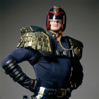

** Резюме **

*Резюме*

Основная информация:

ФИО: Дурнев Иван Александрович

Абзац текста обо мне: Не курю, женат, имеются водительские права. Хобби – программирование, чтение научной литературы.

Список навыков:

* Хорошее знание операционных систем семейства Windows
* Знание таких языков программирования как: Delphi, Pascal, HTML
* Хорошее знание локальных сетей

Адрес для контакта (E-mail): comp-1984@yandex.ru
